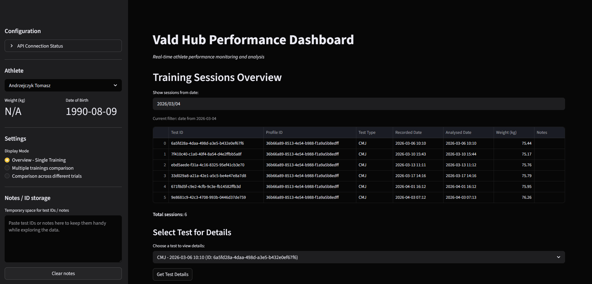

# Vald Hub Integration Dashboard

A **Streamlit-based performance monitoring dashboard** for Vald Hub athlete data. The app fetches real-time data from the Vald Hub API and presents it in a clean, interactive UI focused on **force plate metrics analysis**.

---

## What This App Does

This dashboard is designed to help analyze athlete performance data with a strong focus on:

* **Metric categorization** (Output, Eccentric, Concentric, Asymmetry, etc.)
* **Interactive charts** (mean/std, comparisons, trends)
* **Athlete-level analysis**
* **Left vs Right & Asymmetry tracking**
* **Full metric exploration (100+ metrics supported)**

---

## App overview

### 1. Main Dashboard View



### 2. Athlete Analysis

*Show dropdown + individual athlete charts*

```
/docs/screenshots/athlete_analysis.png
```

### 3. Metric Categories View

*Show grouped metrics (Output, Eccentric, etc.)*

```
/docs/screenshots/metric_categories.png
```

### 4. Asymmetry / Left vs Right Charts

```
/docs/screenshots/asymmetry_chart.png
```


## Configuration

1. Copy environment file:

```bash
cp .env.example .env
```

2. Add your credentials:

```env
CLIENT_ID=""
CLIENT_SECRET=""
TENANT_ID="" #obtained from api
CATEGORIES_ID="" #teams - obtained from api
CATEGORIES_ID_UNCATEGORISED="" #uncategorised team - obtained from api
```

---

## Running the App

```bash
streamlit run app.py
```

Then open:

```
http://localhost:8501
```

---

## How to Use

### 1. Select Test Type

Choose the type of test (e.g. CMJ, SJ, etc.)

### 2. Select Athletes

Filter one or multiple athletes

### 3. Explore Metrics

Metrics are grouped automatically into categories:

* Output
* Monitoring
* Unweighting
* Eccentric
* Concentric
* Landing
* Asymmetry

### 4. Analyze Charts

Available visualizations include:

* Mean & Standard Deviation
* Left vs Right comparison
* Asymmetry charts
* Trends over time

---

## Project Structure

```
vald-hub-integration/
├── app.py
├── requirements.txt
├── .env.example
├── .gitignore
├── src/
│   ├── vald_client.py
│   ├── visualizations.py
│   ├── data_prep_funcs.py
│   └── metric_categories.py
```

## Requirements

* Python **3.9+ recommended**
* Internet connection (for API access)

---

---

## Key Technical Notes

* App uses **Streamlit caching** for performance
* Supports **100+ metrics from API**
* Metrics are dynamically grouped by base name
* Handles inconsistent metric naming via normalization

---

## Troubleshooting

### App won’t start

```bash
streamlit cache clear
pip install -r requirements.txt --force-reinstall
```

### API issues

* Check `.env` file
* Verify API key
* Ensure internet connection

### macOS issues

Use:

```bash
python3
```

### Windows issues

Use:

```bash
python
```

---

## Development

To extend the app:

* Add API logic → `src/vald_client.py`
* Add charts → `src/visualizations.py`
* Add categories → `src/metric_categories.py`

---

## Tips

* Use smaller athlete subsets for faster rendering
* Cache heavy computations with:

```python
@st.cache_data(ttl=300)
```

* UI can be customized via `.streamlit/config.toml`

---
