# Vald Hub Integration Dashboard

A **Streamlit-based performance monitoring dashboard** for Vald Hub athlete data. The app fetches real-time data from the Vald Hub API and presents it in a clean, interactive UI focused on **force plate metrics analysis**.

## What is Vald Hub

[VALD Hub](https://vald.com/) is a cloud-based platform used for collecting, storing, and analysing data from VALD performance measurement systems. It allows integration of different measurement devices and provides tools for monitoring athlete performance.

This application uses data collected from **ForceDecks** systems, which are dual force plate devices designed to measure ground reaction forces during different types of movements, such as jumps, balance tests, and strength assessments.

ForceDecks record the forces applied by the athlete onto the platforms with high temporal resolution. Based on these measurements, various biomechanical metrics can be calculated, including:

- peak force,
- relative force,
- impulse,
- rate of force development (RFD),
- time-related parameters,
- asymmetry between left and right limb.

The collected force-time signals are uploaded to Vald Hub, where they can be analysed and accessed through the platform. This application retrieves the stored measurements and provides additional tools for visualisation, comparison, and analysis of training sessions.

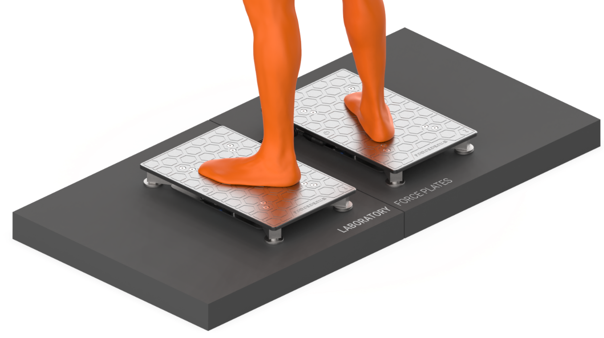

## What This App Does

This dashboard is designed to help analyze athlete performance data with a strong focus on:

* **Metric categorization** (Output, Eccentric, Concentric, Asymmetry, etc.)
* **Interactive charts** (mean/std, comparisons, trends)
* **Athlete-level analysis**
* **Left vs Right & Asymmetry tracking**
* **Full metric exploration (100+ metrics supported)**


## App overview

The application provides tools for analysing and comparing athlete training data retrieved from the connected Vald Hub account. The interface is divided into three main analysis modes: single training overview, multiple training comparison, and comparison of individual trials across different training sessions.

### 1. Main Dashboard View

The dashboard is the main entry point of the application.

From this view, the user can:
- select an athlete from the list retrieved from the connected Vald Hub account,
- view basic athlete information, including date of birth,
- choose one of the available analysis modes:
  - overview of a single training session,
  - comparison of multiple training sessions,
  - comparison of individual trials from different sessions.

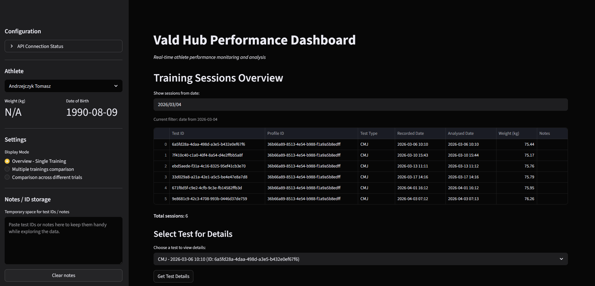


### 2. Mode: *Overview - Single Training*

This mode allows detailed analysis of a selected training session.

The workflow consists of:
- loading all available sessions for the selected athlete,
- selecting the training session to analyse,
- choosing the metrics to be displayed,
- calculating the selected parameters and generating visualisations.

The results are presented as interactive charts allowing detailed inspection of the selected training data.

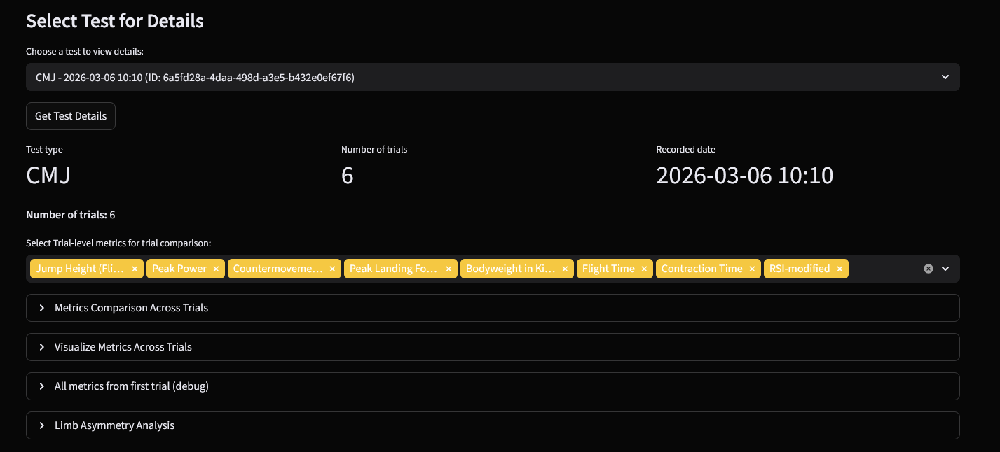
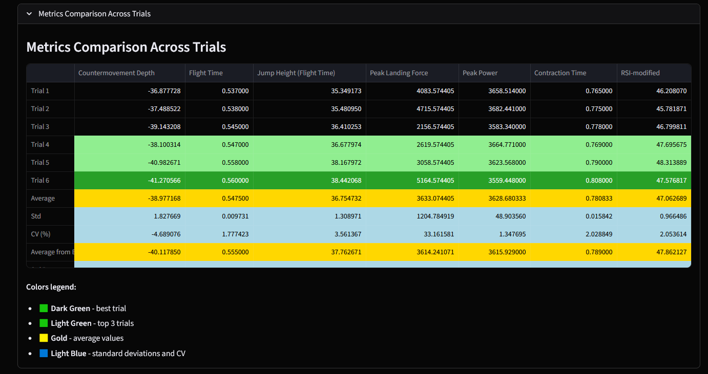
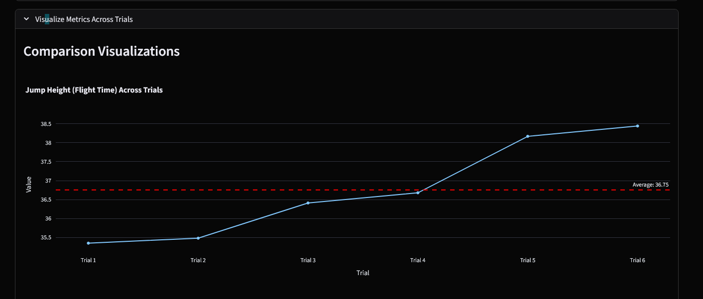
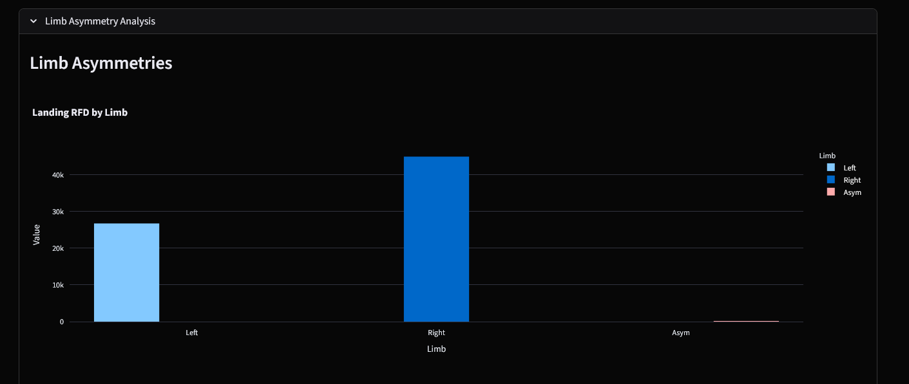


### 3. Mode: *Multiple Trainings Comparison*

This mode enables comparison of results across multiple training sessions.

The user can:
- select the training type,
- define the analysed date range,
- select specific training indices,
- exclude sessions that may introduce unwanted distortions into the analysis (e.g. sessions affected by injuries or abnormal conditions),
- choose the metrics to compare.

After data preparation, the application generates comparative visualisations for the selected sessions.

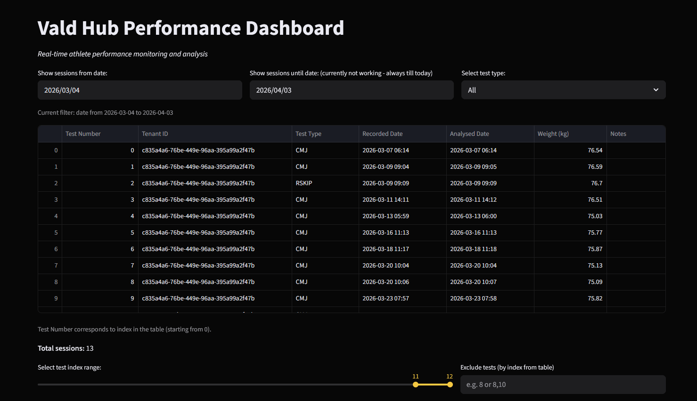
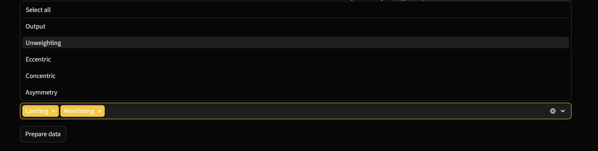
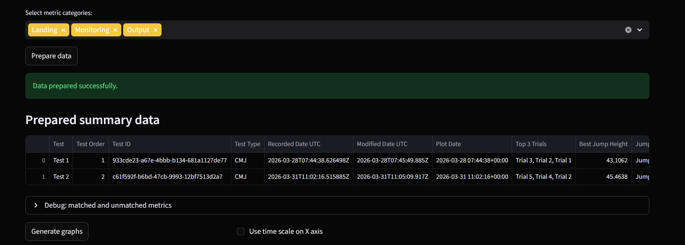
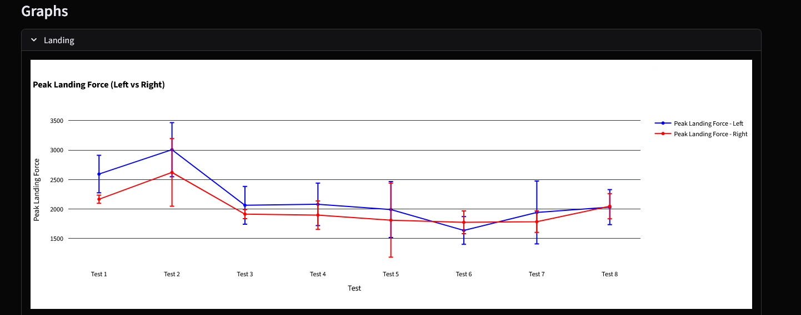


### 4. Mode: *Comparison Across Different Trials*

This mode allows comparison of individual trials recorded during different training sessions.

The workflow includes:
- entering the test number obtained from the multiple training comparison view,
- loading the corresponding trial data,
- selecting the trials to display,
- adjusting visualisation parameters, such as signal shift and analysed leg.

The final visualisation enables direct comparison of selected trials from different training sessions.

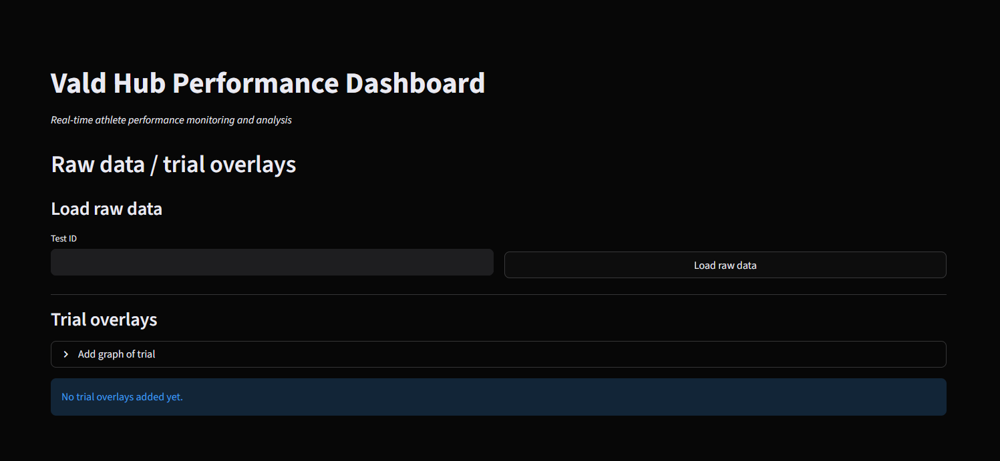
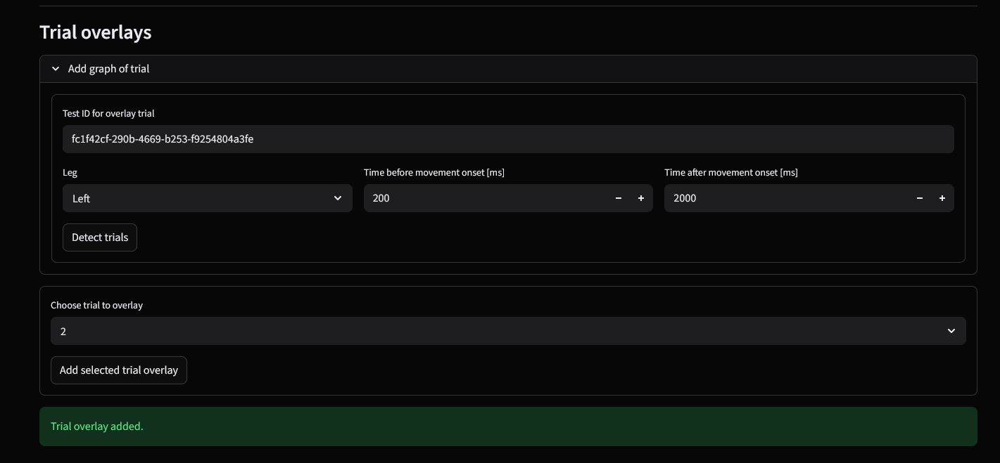
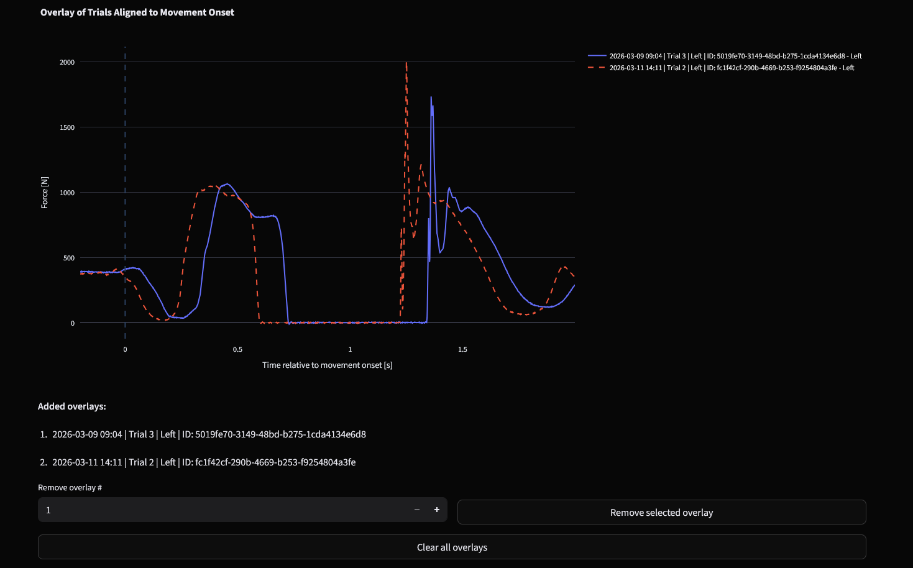

## Configuration

1. Copy environment file:

```bash
cp .env.example .env
```

2. Add your credentials:

```env
CLIENT_ID=""
CLIENT_SECRET=""
TENANT_ID="" #obtained from api
CATEGORIES_ID="" #teams - obtained from api
CATEGORIES_ID_UNCATEGORISED="" #uncategorised team - obtained from api
```

---

## Running the App

```bash
streamlit run app.py
```

Then open:

```
http://localhost:8501
```

---

## How to Use

### 1. Select Test Type

Choose the type of test (e.g. CMJ, SJ, etc.)

### 2. Select Athletes

Filter one or multiple athletes

### 3. Explore Metrics

Metrics are grouped automatically into categories:

* Output
* Monitoring
* Unweighting
* Eccentric
* Concentric
* Landing
* Asymmetry

### 4. Analyze Charts

Available visualizations include:

* Mean & Standard Deviation
* Left vs Right comparison
* Asymmetry charts
* Trends over time

---

## Project Structure

```
vald-hub-integration/
├── app.py
├── requirements.txt
├── .env.example
├── .gitignore
├── src/
│   ├── vald_client.py
│   ├── visualizations.py
│   ├── data_prep_funcs.py
│   └── metric_categories.py
```

## Requirements

* Python **3.9+ recommended**
* Internet connection (for API access)

---

---

## Key Technical Notes

* App uses **Streamlit caching** for performance
* Supports **100+ metrics from API**
* Metrics are dynamically grouped by base name
* Handles inconsistent metric naming via normalization

---

## Troubleshooting

### App won’t start

```bash
streamlit cache clear
pip install -r requirements.txt --force-reinstall
```

### API issues

* Check `.env` file
* Verify API key
* Ensure internet connection

### macOS issues

Use:

```bash
python3
```

### Windows issues

Use:

```bash
python
```

---

## Development

To extend the app:

* Add API logic → `src/vald_client.py`
* Add charts → `src/visualizations.py`
* Add categories → `src/metric_categories.py`

---

## Tips

* Use smaller athlete subsets for faster rendering
* Cache heavy computations with:

```python
@st.cache_data(ttl=300)
```

* UI can be customized via `.streamlit/config.toml`

---
